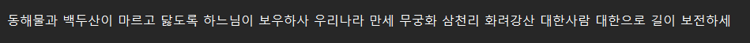

## FLASK
The project uploads the file to S3.
You have to write the phrase included in the picture to upload it to S3 normally.
## Installation
Install flask and boto3
~~~sh
pip install flask
pip install boto3
~~~
## Project Structure
```sh
├─ app.py
├─ module.py
├─ README.md
├─Sample
│ ├─ sample.png
│ ├─ test.txt
│ ├─ test2.txt
├─static
│  ├─css
│  │ ├──style.css
│  └─img
│    ├──image.png
├─templates
│ ├─ index.html
├─uploads
│ ├─test2.txt
└─__pycache__
```
## Configuration
Specify the destination bucket and destination folder.
~~~python
import os
from flask import Flask, render_template, request, redirect, send_file
from werkzeug.utils import secure_filename
import module

app = Flask(__name__)
UPLOAD_FOLDER = "uploads"
BUCKET = "demo-111-2"
~~~

## National anthem
You must enter the same content as the picture in order to upload the file.



## material
- S3
- IAM
- upload file

The files to upload are located in the Sample path.
~~~sh
├─Sample
│ ├─ sample.png
│ ├─ test.txt
│ ├─ test2.txt
~~~